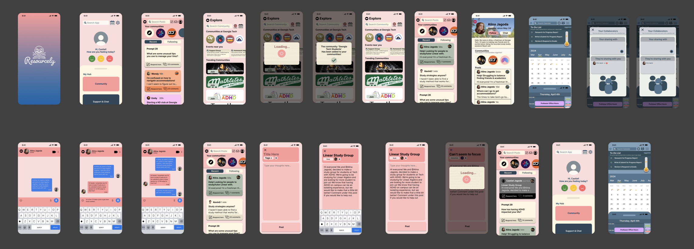

# Resourcely – Mental Health Companion Chatbot

**Resourcely** is a mental health companion chatbot developed as part of a project at the Georgia Institute of Technology (Aug 2024). It leverages natural language understanding and user-centered design to support students—especially those with ADHD—by providing wellness resources, mood tracking, and empathetic conversation support.

## 💡 Project Overview

Resourcely aims to help users manage their mental health through:

- Personalized daily wellness suggestions
- Real-time customer support and FAQ automation
- Mood tracking and self-care check-ins
- Empathy-driven chatbot interactions

## 🧠 Tech Stack

- **Python**
- **Rasa NLU** – for intent classification and entity extraction
- **Dialogflow** – for fallback NLU and conversation routing
- **Figma** – for UI/UX prototyping
- **Jupyter Notebook** – for training and testing

## 🎨 Design

We used **Figma** to create high-fidelity prototypes based on user research with students experiencing ADHD. These prototypes guided the chatbot’s UX and response tone.

## 📈 Impact

- 40% reduction in average response time
- Improved user engagement through proactive mood check-ins
- Trained on annotated conversation samples for better empathy and understanding

## 🚀 Future Enhancements

- Integrate with real-time mental health resource APIs
- Deploy on mobile and web platforms
- Incorporate sentiment analysis and emotion recognition

---

**Disclaimer**: This project is for educational and prototyping purposes and is not a substitute for professional mental health care.
